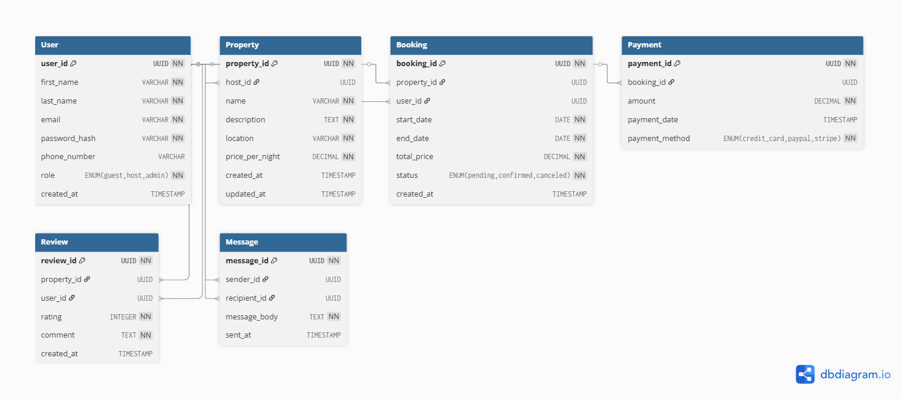

# Airbnb Database - ER Diagram

## 🎯 Objective
The objective of this task is to design and visualize the Entity-Relationship (ER) diagram for the Airbnb clone database.  
It includes entities such as User, Property, Booking, Payment, Review, and Message, along with their relationships.

---

## 🏗️ Entities and Attributes

### 1. User
- user_id (PK)
- first_name
- last_name
- email (Unique)
- password_hash
- phone_number
- role (guest, host, admin)
- created_at

### 2. Property
- property_id (PK)
- host_id (FK → User.user_id)
- name
- description
- location
- price_per_night
- created_at
- updated_at

### 3. Booking
- booking_id (PK)
- property_id (FK → Property.property_id)
- user_id (FK → User.user_id)
- start_date
- end_date
- total_price
- status (pending, confirmed, canceled)
- created_at

### 4. Payment
- payment_id (PK)
- booking_id (FK → Booking.booking_id)
- amount
- payment_date
- payment_method (credit_card, paypal, stripe)

### 5. Review
- review_id (PK)
- property_id (FK → Property.property_id)
- user_id (FK → User.user_id)
- rating (1–5)
- comment
- created_at

### 6. Message
- message_id (PK)
- sender_id (FK → User.user_id)
- recipient_id (FK → User.user_id)
- message_body
- sent_at

---

## 🔗 Relationships

- A **User** can be a **Host** (own many Properties).  
  `User (1) —— (N) Property`
- A **User** can make multiple **Bookings**.  
  `User (1) —— (N) Booking`
- A **Property** can have multiple **Bookings**.  
  `Property (1) —— (N) Booking`
- Each **Booking** can have one **Payment**.  
  `Booking (1) —— (1) Payment`
- A **Property** can have multiple **Reviews**.  
  `Property (1) —— (N) Review`
- A **User** can send multiple **Messages** to another User.  
  `User (1) —— (N) Message`


```markdown

